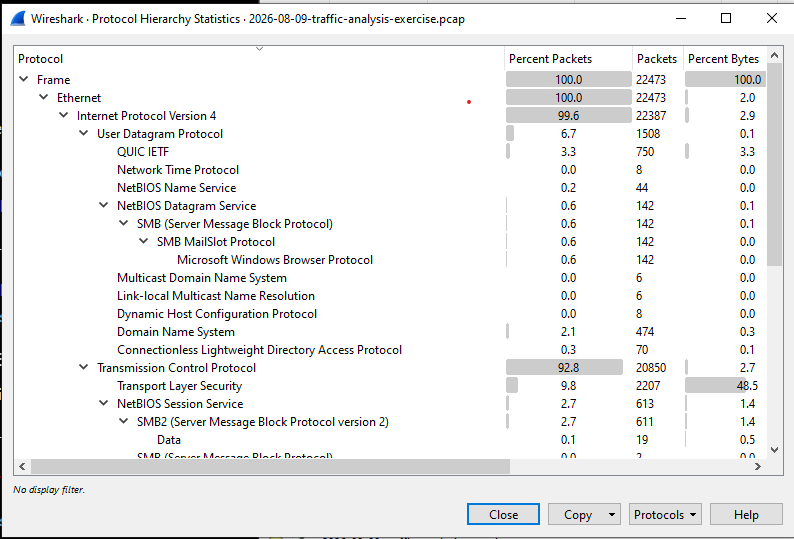
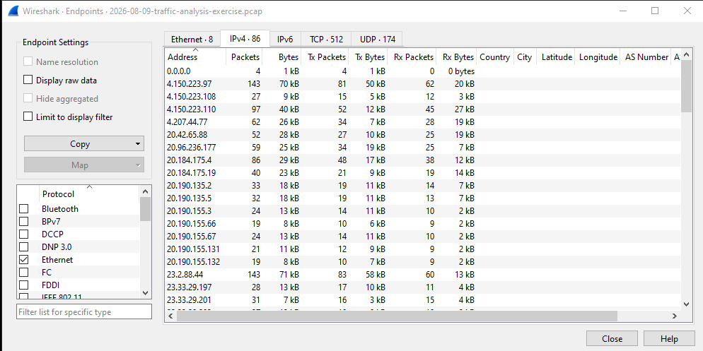
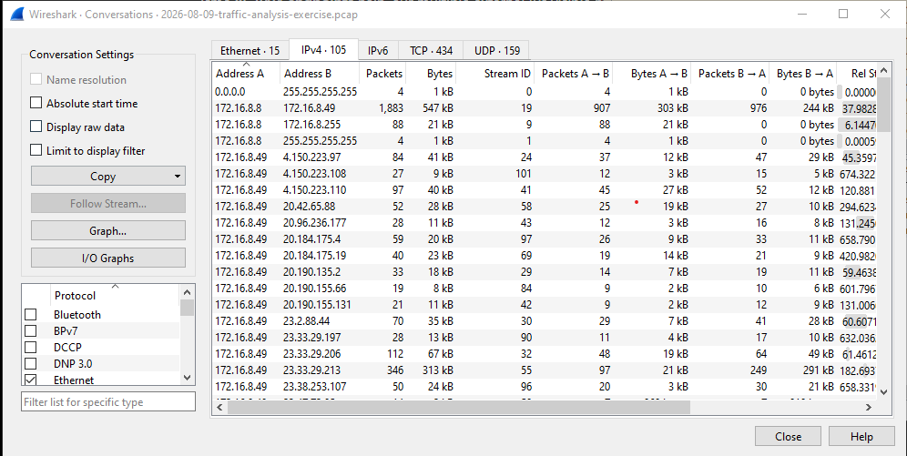
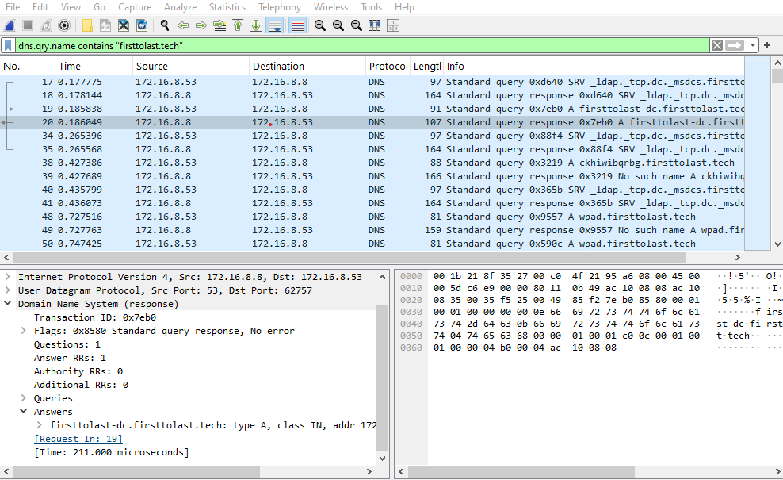
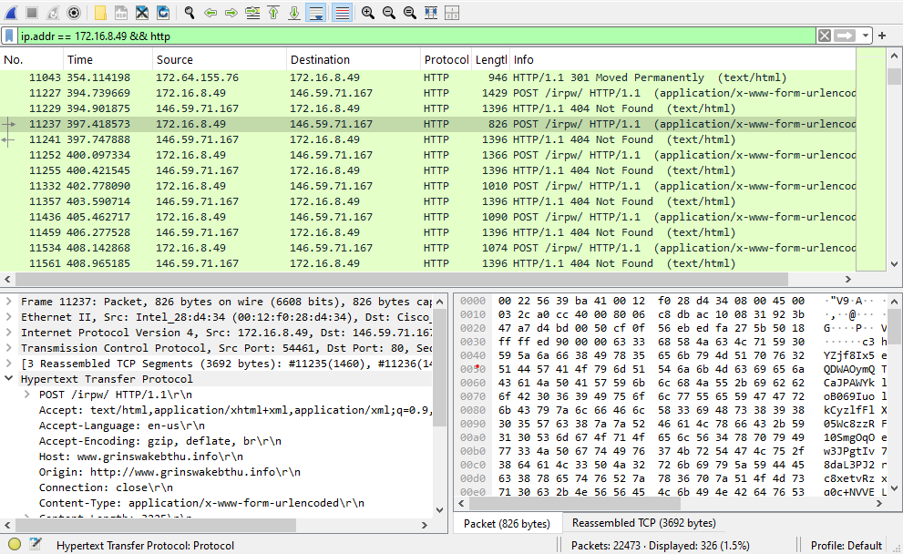
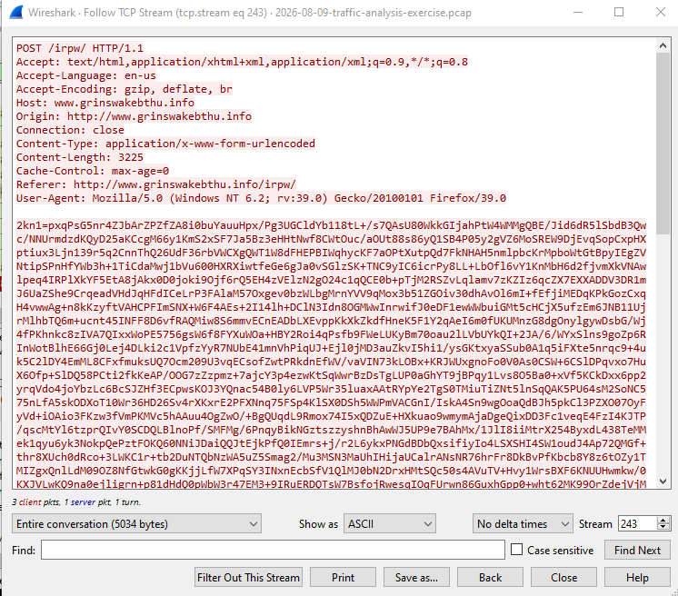

# Network Intrusion — Wireshark PCAP Analysis

## Overview

This project analyzes the PCAP file `2026-08-09-traffic-analysis-exercise.pcap` using Wireshark.

The investigation focuses on identifying suspicious network communication and documenting the evidence like a SOC analyst.

---

## Alert

Repeated outbound HTTP POST traffic was identified from internal host:

`172.16.8.49`

to:

`146.59.71.167`

The traffic used:

`www.grinswakebthu.info`

with repeated requests to:

`POST /irpw/ HTTP/1.1`

The activity was investigated as suspicious network traffic.

---

## Investigation

### 1. Protocol Analysis

The Protocol Hierarchy was reviewed to understand the overall traffic in the PCAP.

### 2. Endpoint Analysis

IPv4 endpoints were reviewed to identify active hosts.

The internal host `172.16.8.49` was selected for further investigation.

### 3. Conversation Analysis

IPv4 conversations were reviewed to identify communication between internal and external hosts.

### 4. DNS Analysis

DNS traffic was investigated using:

`dns.qry.name contains "firsttolast.tech"`

A successful DNS response was observed for:

`firsttolast-dc.firsttolast.tech`

### 5. HTTP Investigation

HTTP traffic from `172.16.8.49` was filtered using:

`ip.addr == 172.16.8.49 && http`

Repeated POST requests were observed to:

`146.59.71.167`

The request used:

`POST /irpw/`

and:

`www.grinswakebthu.info`

### 6. TCP Stream Analysis

The HTTP request was followed as a TCP stream.

The stream showed:

- `POST /irpw/ HTTP/1.1`
- Host: `www.grinswakebthu.info`
- Content-Type: `application/x-www-form-urlencoded`
- Content-Length: `3225`
- Large encoded/random-looking request data

---

## Evidence Summary

| Indicator | Value |
|---|---|
| Internal Host | `172.16.8.49` |
| External IP | `146.59.71.167` |
| External Host | `www.grinswakebthu.info` |
| HTTP Method | POST |
| URI | `/irpw/` |
| Content-Type | `application/x-www-form-urlencoded` |
| Content-Length | `3225` |

---

## MITRE ATT&CK

### T1071.001 — Web Protocols: HTTP/HTTPS

The investigated communication used HTTP for outbound communication between the internal host and an external server.

---

## Conclusion

The PCAP shows repeated outbound HTTP POST communication from `172.16.8.49` to `146.59.71.167`.

The unusual external domain, repeated `/irpw/` POST requests and large encoded-looking request body make the activity suspicious and suitable for further investigation.

The PCAP alone does not prove that the host was compromised or that the destination was definitely a C2 server.

---

## Recommended Actions

- Investigate host `172.16.8.49` for suspicious processes and files.
- Check DNS, proxy and firewall logs for `www.grinswakebthu.info` and `146.59.71.167`.
- Search for other internal hosts communicating with the same destination.
- Run an endpoint security/malware scan on `172.16.8.49`.
- Block or monitor the destination if additional investigation confirms malicious activity.

---

## Tools

- Wireshark
- PCAP network capture
- MITRE ATT&CK
